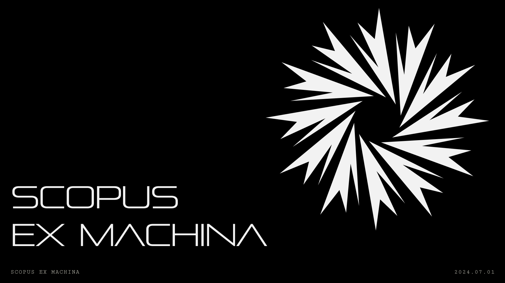

# Algorithmic Eye

>Arguing that you don’t care about the right to privacy because you have nothing to hide is no different than saying you don’t care about free speech because you have nothing to say.
>
>– Edward Snowden

 

This site collects works under the Algorithmic Eye umbrella.

## Projects 

Two projects are currently in progress:

### Scopus Ex Machina

Scopus Ex Machina is a zine I'm producing to highlight the increasing power of the surveillance aparatus with sights currently trained on you and me.

### Scopeo

Scopeo is a roll-your-own facial recognition system that I'm building. The output of the project is undetermined at this time, but I'm doing the work to identify what that will be.

## Listen Up

[Why privacy is important, and having "nothing to hide" is irrelevant](https://robindoherty.com/2016/01/06/nothing-to-hide.html), by Robin Doherty, Jan 6, 2016